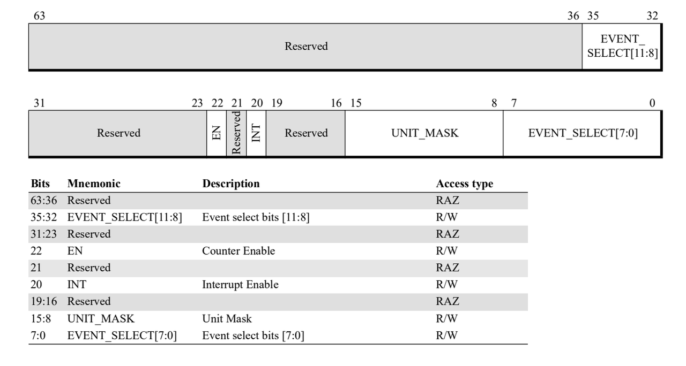
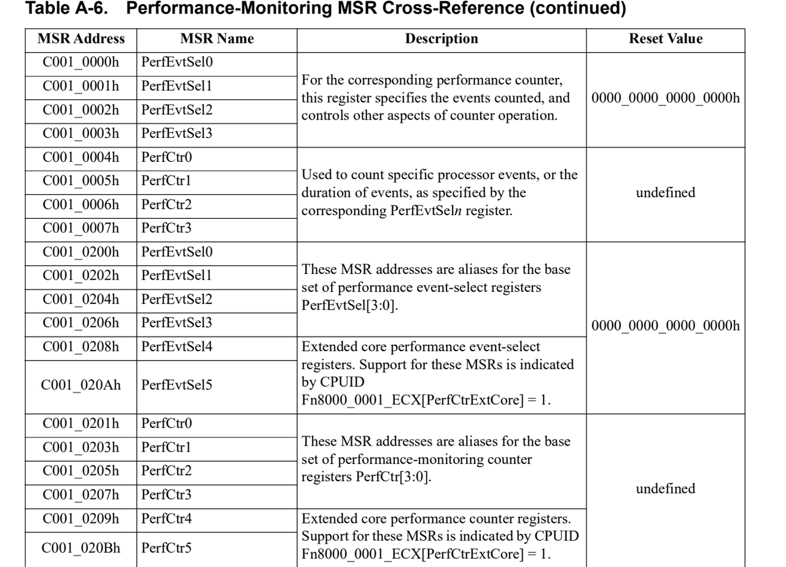
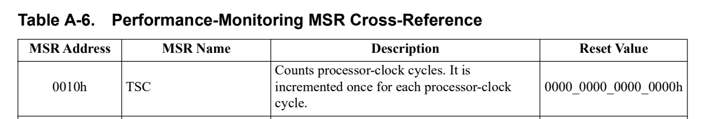
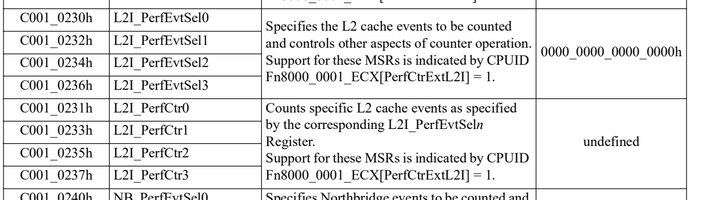
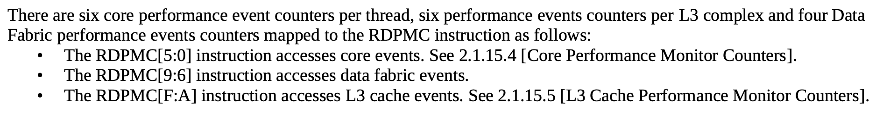
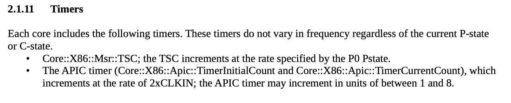

# AMD PMU使用

在AMD中PMU被划分为软件调试和性能资源。

参考文献：

- AMD64 Architecture Programmer’s Manual Volume 2: System Programming https://www.amd.com/content/dam/amd/en/documents/processor-tech-docs/programmer-references/24593.pdf， 第13章，Software Debug and Performance Resources。

- AMD processor programming reference for zen3 https://www.amd.com/content/dam/amd/en/documents/processor-tech-docs/revision-guides/56683.pdf

## 介绍

这些软件调试资源分为四类：

1. Software debug: 使用DR0-DR7寄存器进行调试
2. Performance monitoringcounters
3. Instruction-based sampling
4. Lightweight profiling
对于PMC的使用中，没有发现和Intel中IA32_PERF_GLOBAL_CTRL寄存器类似的msr，只有evtsel_n和perfCtr_n的寄存器。

启用和停止事件采样的方法是修改evtsel_n[en]，该寄存器的编码如下：

各种PMC的MSR地址如下：

此外还有一个特殊的地方在于，AMD中读计时和L2i等事件都有单独的寄存器来进行。

TIPS：
记得sudo modprobe msr

## 使用

### RDPMC使用

从上述截图可以看到，AMD中读不同类型的PMU事件需要使用不同counter，分为三类
- Core performance monitor counters
- Data fabric events
- L3 cache performance monitor counters

### PERF_CTL[0-5]

Performance event select，关注低24位即可

### PERF_CTR[0-5]

Performance event counter
可以使用rdpmc指令读取相应寄存器的值，和Intel类似，通过ecx指定0-5的计数器，通过edx:eax读取value。

### 计时

